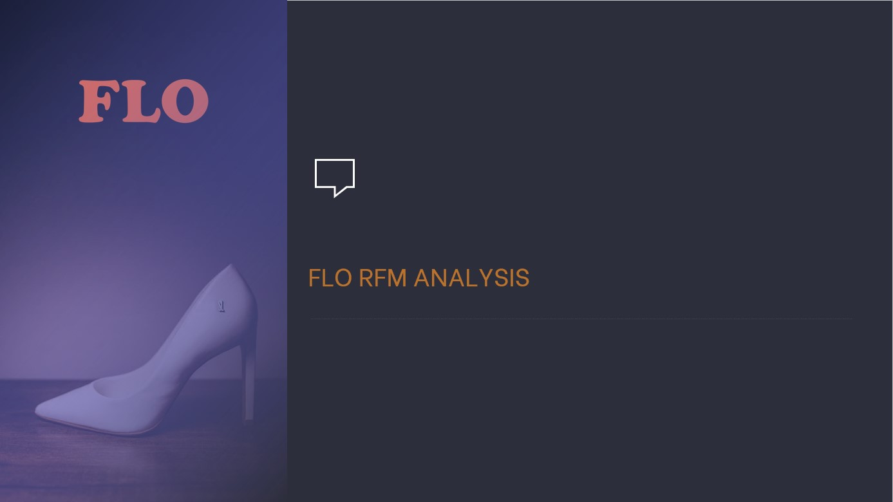

# FLO_RFM_Analysis README

## Business Problem & Purpose

FLO, which is an online shoe store
segments and marketing according to these segments 
to determine strategies. 

For this purpose customers' behaviour will be defined and this
groups will be formed according to clusters in behaviours.

## Data Set Information

**flo_data_20K.csv**

The dataset includes OmniChannel (both online and offline shoppers) who made their last purchase from Flo in 2020 - 2021
It consists of information obtained from the past shopping behaviour of the customers who shop as a customer.

   12 Variable                       19.945 Observation

| master_id | Unique customer number |
| --- | --- |
| order_channel | order_channel Which channel of the shopping platform is used (Android, ios, Desktop, Mobile) |
| last_order_channel | The channel where the last purchase was made |
| first_order_date | Date of the customer's first purchase |
| last_order_date | Date of the last purchase made by the customer |
| last_order_date_online | Date of the customer's last purchase on the online platform |
| last_order_date_offline | Date of the customer's last offline purchase |
| order_num_total_ever_online | Total number of purchases made by the customer on the online platform |
| order_num_total_ever_offline | Total number of offline purchases made by the customer |
| customer_value_total_ever_offline | Total price paid by the customer for offline shopping |
| customer_value_total_ever_online | Total price paid by the customer for online shopping |
| interested_in_categories_12 | List of categories in which the customer has shopped in the last 12 months |

## Project Steps

- Data Understanding and Preparation
- Calculation of RFM Metrics
- Calculation of RF Score
- Segmental Identification of the RF&RFM Score

## Libraries

pandas